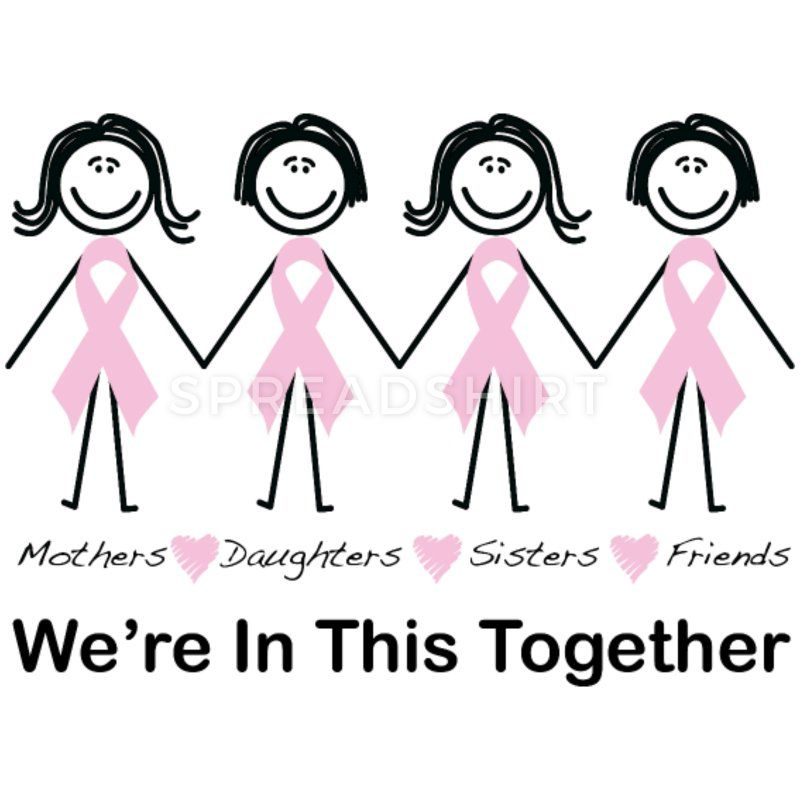

# Breast Friends

## *Project Description* : 
This is a project about creating a twitter bot that retweets all posts about breast cancer awareness.
This project was conducted at a workshop during a learnership hosted by [Girlcode](https://github.com/GirlCodeZA)

It was built using **Python**.
## Tools used : *IDLE* and *Visual Studio Code*.

### How to be involved in the project
To keep up with the bot you can follow the twitter account [Breast Friends](https://twitter.com/NonnyMahao) and check out all the informative retweets about breast cancer.

### Contributions
Contributions are welcome. To contribute you can open a new issue or do a pull request.

### Author : **[Nonny Mahao](https://github.com/Nonny-Mahao)** 

### Licence
This project is [MIT](https://www.google.com) licensed.